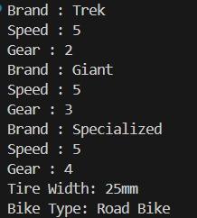
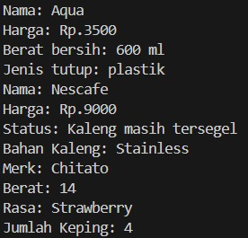

# Laporan Praktikum Pemrograman Berbasis Objek

## joobshet 1

## Identintas Mahasiswa 

- *Nama* : Syahrur Ramadhan
- *Nim*  : 254107020008
- *Kelas* : TI-2G
- *Repository : https://github.com/syahrur2602/PrakPBO26_2G_26/tree/main/Pertemuan-1

## 3. Percobaan 

## 3.1 Percobaan 1
*Output*

## 3.2 Percobaan 2
*Output*

## 5. Pertanyaan

1. Jelaskan perbedaan antara object dengan class! 
*Jawab:* Class adalah blueprint atau cetakan yang mendefinisikan atribut dan method.Object adalah hasil instansiasi dari class, yaitu wujud nyata yang memiliki nilai atribut dan dapat menjalankan method. Contoh: class Bike adalah blueprint, sedangkan Bike mountainBike1 = new Bike(); adalah object

2. Jelaskan alasan gear dan brand dapat menjadi atribut dari object Bike! 
*Jawab:* Brand menunjukkan identitas sepeda (misalnya Trek, Giant) Gear menunjukkan kondisi teknis sepeda yang memengaruhi kecepatan. Keduanya merupakan bagian dari state yang membedakan satu object Bike dengan object Bike lainnya

3. Sebutkan salah satu kelebihan utama dari pemrograman berorientasi objek dibandingkan 
dengan pemrograman prosedural! 
*Jawab:* Program lebih mudah dikembangkan dan dirawat karena perubahan pada satu class tidak akan mengganggu keseluruhan program. Hal ini berbeda dengan prosedural yang lebih rawan rusak jika ada perubahan kecil

4. Apakah diperbolehkan melakukan pendefinisian dua buah atribut dalam satu baris kode seperti 
“public String nama, alamat;”? 
*Jawab:* Ya, diperbolehkan. Java mendukung deklarasi beberapa variabel dengan tipe data yang sama dalam satu baris. Namun, praktik terbaik biasanya memisahkan agar lebih mudah dibaca

5. Pada class RoadBike, jelaskan alasan atribut brand, speed, dan gear tidak lagi ditulis di dalam 
class tersebut!  
*Jawab:* Semua atribut brand, speed, dan gear sudah dimiliki oleh RoadBike melalui inheritance. Tidak perlu mendefinisikan ulang, cukup menambahkan atribut baru (tireWidth) dan method tambahan yang spesifik untuk RoadBike

## 6. Tugas Praktikum

1. Lakukan langkah-langkah berikut supaya tugas praktikum yang dikerjakan tersistematis: 
a. Foto 4 buah objek di sekitar kalian dengan 2 objek di antaranya merupakan objek yang 
mengandung konsep pewarisan (inheritance), contoh: kulkas, kursi, meja ruang tamu, meja 
belajar sehingga diketahui meja ruang tamu dan meja belajar mewarisi objek meja!  
b. Lakukan pengamatan terhadap 4 objek tersebut untuk menentukan atribut dan methodnya! 
c. Berdasarkan 4 buah objek tersebut, buat class nya dalam Bahasa pemrograman Java!  
d. Perlu diperhatikan bahwa terdapat dua class hasil pewarisan sehingga perlu menambah satu 
class baru sebagai class yang mewarisi dua class tersebut! 
e. Tambahkan dua atribut untuk setiap class! 
f. 
Tambahkan tiga method untuk setiap class termasuk method cetak informasi! 
g. Tambahkan satu class Demo sebagai main! 
h. Instansiasikan satu buah objek untuk setiap class! 
i. 
Terapkan setiap method untuk setiap objek yang dibuat! 
j. 
Contoh yang telah disebutkan pada poin 1.a tidak diperbolehkan dipakai dalam pengerjaan 
tugas praktikum ini!
*Output*
