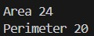
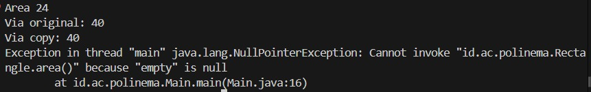
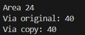
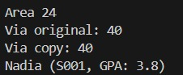
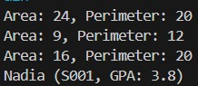

# Laporan Praktikum Pemrograman Berbasis Objek

## joobshet 1

## Identintas Mahasiswa 

- *Nama* : Syahrur Ramadhan
- *Nim*  : 254107020008
- *Kelas* : TI-2G
- *Repository : https://github.com/syahrur2602/PrakPBO26_2G_26/tree/main/Pertemuan-2

## 3. Langkah

## Langkah 1
*Output*

## Langkah 2
*Output*

## Langkah 3
*Output*

## Langkah 4
*Output*

## Langkah 5
*Output*

## Langkah 6
*Output*

## 6. Tugas Praktikum
1. 
2. Jawab singkat (2-3 kalimat masing-masing)
a. Apa bedanya objek dengan referensi ke objek?
*Jawab:* Objek adalah area memori riil yang menampung data dan perilaku sesuai cetak biru (kelas) tertentu. Sementara itu, referensi ke objek adalah variabel penunjuk yang menyimpan alamat memori dari lokasi objek tersebut berada, bukan fisik objeknya itu sendiri.

b. Tepatnya kapan konstruktor sebuah kelas dijalankan?
*Jawab:*Konstruktor dijalankan secara otomatis saat pembuatan instansilasi objek baru, tepatnya ketika operator new dipanggil. Proses ini terjadi sebelum objek tersebut siap digunakan, guna mengalokasikan memori dan menginisialisasi nilai awal dari atribut kelas tersebut.

*Output*

